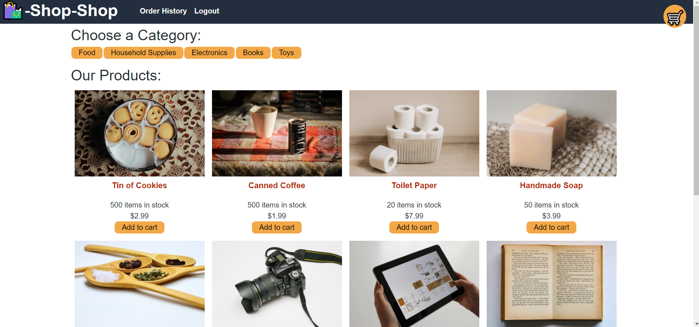

# challenge-22-redux-store

## Description

MERN website using React-Redux for the front-end. I used a starter-code given and then refactored using Redux.

## Installation
Download using npm i which will download all the dependencies.

## Questions
Feel free to email me, Jessica at [email](mailto:jwade1327@gmail.com). Or see other projects at [GitHub](https://github.com/jwade1327).
